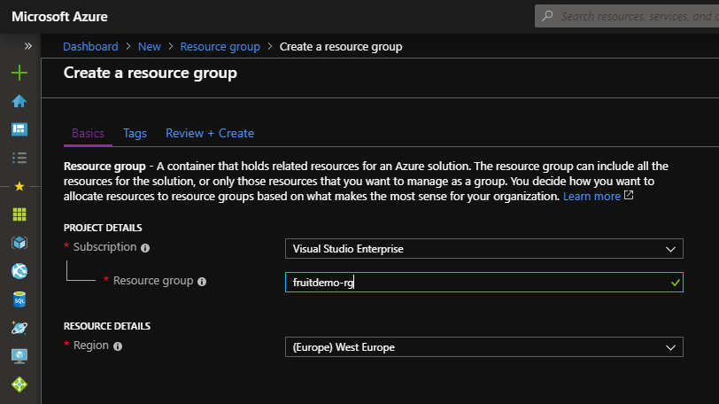

## Create Data Lake

You might want to create the data lake using the portal the first time you do it just to a graphical understanding of how the resources are put together. After this initial deployment it is recommended you use an ARM template so you can repeat it more easily and consistently. 

* [Create in Azure Portal](#Create-in-Azure-Portal)
* [Create with ARM Template](###Create-with-ARM-Template)

### Create in Azure Portal

1. Navigate to the [Azure Portal](https://portal.azure.com). 

2. Create a new resource group called fruitdemo-rg.
    i. Click the green plus and search for resource group.


   ii. Name it fruitdemo-rg and created it West Europe region. 



3. Create a new data lake called fruitdemodtlk.
  i. Click the green plus and search for data lake. 


   ii. Name it fruitdemodtlk, use your appropriate subscription, use the resource group fruitdemo-rg, create it in the West Europe region and choose pay as you go. 


4. Navigate to your fruitdemo-rg and you will now see your data lake resource. 

### Create with ARM Template

1. In your Visual Studio solution with the console app project, create a new Azure Resource Group Project called "FruitARM". 

2. Rename the files to be datalake.json and datalake.parameters.json. 

3. In the datalake.parameters.json file, copy paste the following code.

```json
{
  "$schema": "https://schema.management.azure.com/schemas/2015-01-01/deploymentParameters.json#",
  "contentVersion": "1.0.0.0",
  "parameters": {
    "dataLakeStorageName": {
      "value": "fruitdemodtlk"
    },
    "dataLakeStorageLocation": {
      "value": "West Europe"
    }
  }
}
```

4. In the datalake.json file, copy and paste the following code.

```json
{
  "$schema": "http://schema.management.azure.com/schemas/2015-01-01/deploymentTemplate.json#",
  "contentVersion": "1.0.0.0",
  "parameters": {
    "dataLakeStorageName": {
      "type": "string",
      "metadata": {
        "description": "The name of the Data Lake Store account to create."
      }
    },
    "dataLakeStorageLocation": {
      "type": "string",
      "allowedValues": [
        "East US 2",
        "Central US",
        "North Europe",
        "West Europe"
      ],
      "defaultValue": "West Europe",
      "metadata": {
        "description": "The location in which the resources will be created."
      }
    }
  },
  "variables": {
    "dataLakeStorageApiVersion": "2016-11-01"
  },
  "resources": [
    {
      "type": "Microsoft.DataLakeStore/accounts",
      "name": "[parameters('dataLakeStorageName')]",
      "apiVersion": "[variables('dataLakeStorageApiVersion')]",
      "location": "[parameters('dataLakeStorageLocation')]"
    }
  ],
  "outputs": {
    "adlStoreAccount": {
      "type": "object",
      "value": "[reference(resourceId('Microsoft.DataLakeStore/accounts',parameters('dataLakeStorageName')))]"
    }
  }
}
```

5. Right-click the FruitARM project and select Deploy > New. 
  Choose the fruitdemo-rg resource group and ensure your correct template and parameters file are chosen for the data lake resource. 


6. Confirm after deployment, which you can monitor via the output window, that the data lake is in your resource group. 