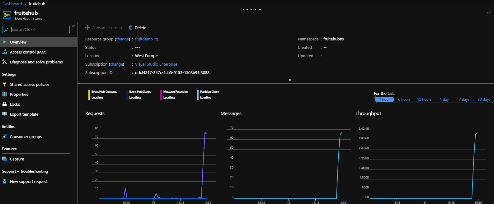

## Add Eventhub to Fruit App

1. Open your fruit console application that you created. 

2. In the Program.cs we will now create the fruit and output its properties to a console line in JSON format. In order to do this we first need to install the Newtonsoft.JSON package using the package manager. 
   a. Go to Tools > Nuget Package Manager > Package Manager Console. 
   b. Copy and paste this into the console - Install-Package Microsoft.Azure.EventHubs - and press return. 
   c. Wait for the console to return package installed succesfully. This will allow us to serialize the fruit object as JSON. 

3. At the top of your Program.cs file, where you can see the using statements, add the following:

```c#
using Microsoft.Azure.EventHubs;
```

4. Where it says class Program in the Program.cs file, add the following code.

```c#
    class Program
    {
        private static EventHubClient eventHubClient;
```

5. After the RandomWait method you have already created, add the following code. 

```c#
        private static async Task EventHubWrapper(string connectionString, string hubName, string message)
        {
         
            var connectionStringBuilder = new EventHubsConnectionStringBuilder(connectionString)    //Install-Package Microsoft.Azure.EventHubs
            {
                EntityPath = hubName
            };

            eventHubClient = EventHubClient.CreateFromConnectionString(connectionStringBuilder.ToString());

            await SendMessageToEventHub(message);

            await eventHubClient.CloseAsync();
        }

        private static async Task SendMessageToEventHub(string message)
        {
            await eventHubClient.SendAsync(new EventData(Encoding.UTF8.GetBytes(message)));
        }
```

6. After the Console.Writeline(message) piece of code, add the following, which will send the serialized message to the event hub.
* Get the whole connehub string value from your fruitsas shared access policy of your eventhub, use 

```c#
                string connehub = "Endpoint=sb://fruitehub.servicebus.windows.net/;SharedAccessKeyName=fruitsas;SharedAccessKey=XXXXXXXXXXXXXXXXXXXXXXXX;";
                string ehubname = "fruitehub";
                   EventHubWrapper(connehub, ehubname, message).GetAwaiter().GetResult();
```

7. Run you console app and confirm that the messages are being sent to the console.

8. While running, navigate to your eventhub and confirm that messages are being received. This may take 2-5 minutes for the Azure Portal graphs to display that it is receiving messages, so be patient :). 

