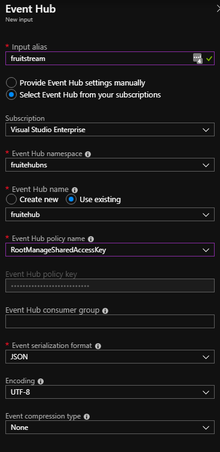

## Create Stream To Lake

You might want to create the event hub using the portal the first time you do it just to a graphical understanding of how the resources are put together. After this initial deployment it is recommended you use an ARM template so you can repeat it more easily and consistently. 

* [Create in Azure Portal](#Create-in-Azure-Portal)
* [Create with Stream Analytics Project](###Create-with-Stream-Analytics-Project])

## Create in Azure Portal

1. Create a new stream analytics job called fruitstream.
  i. Click the green plus and search for stream analytic. 


   ii. Name it fruitstream, use your appropriate subscription, use the resource group fruitdemo-rg, create it in the West Europe region and leave rest as defaults. 


2. Navigate to your fruitdemo-rg and you will now see your stream analytic resource. 

3. Go into your stream analytic job. 

i. Create an input from your eventhub


ii.Set the input alias to be fruitstream, use the frtuiehub you created and ensure the format is set to JSON. Set the rest as below.. (Really another SAS token should be setup with read permissions and not use the root key, but we will use this for the demo)*


4. Create an output...

i. Add an output to Data Lake Storage Gen 1


ii. Call the output fruitlake, ensure the path pattern is **RAW/{date}/{time}**, use the fruit lake you have created in Account Name, set the rest of the details as below and be sure to Authorise with your account at the bottom using "User Token". 


5. Create a query by going to the query property and adding:

```sql
SELECT
    *
INTO
    [fruitlake]
FROM
    [fruitstream]
```


6. Start your console app.

7. Start your stream analytics job (may take a few minutes to start).


8. After a few minutes you should start seeing activity in the messages and also data will go in to your data lake in the location you specified. 


## Create with Stream Analytics Project