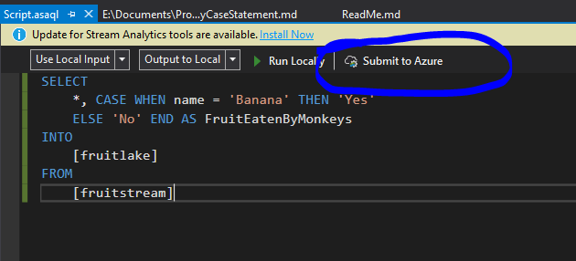

# Create Query Case Statement

To demonstrate how easy it is to use stream analytics and its SQL-like language, we are going to add a case statement to our query to the data lake to get more categorical data in real-time.

* [Amend Query in Azure Portal](###Amend-Query-in-Azure-Portal)
* [Amend Query in Stream Analytics Project](###Amend-Query-in-Stream-Analytics-Project])

### Amend Query in Azure Portal

1. Go to your stream analytics job.

2. Stop the job.

3. Amend the query to have the code below:

```sql
SELECT
    *, CASE WHEN name = 'Banana' THEN 'Yes'
    ELSE 'No' END AS FruitEatenByMonkeys
INTO
    [fruitlake]
FROM
    [fruitstream]
```


4. Start your job.


5. Look in your data lake and see the new data for "FruitEatenByMonkeys". 


### Amend Query in Stream Analytics Project

1. Go to your stream analytics job.

2. Stop the job.

3. In your stream analytics project, amend the query to be the below.

```sql
SELECT
    *, CASE WHEN name = 'Banana' THEN 'Yes'
    ELSE 'No' END AS FruitEatenByMonkeys
INTO
    [fruitlake]
FROM
    [fruitstream]
```



4. Publish your stream job to Azure.

5. Start your job.


6. Look in your data lake and see the new data for "FruitEatenByMonkeys". 

