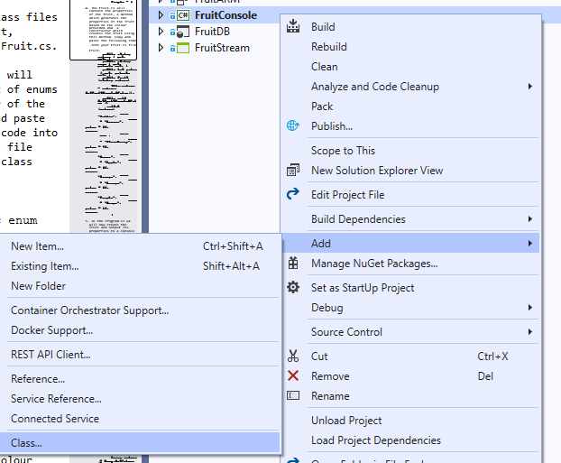
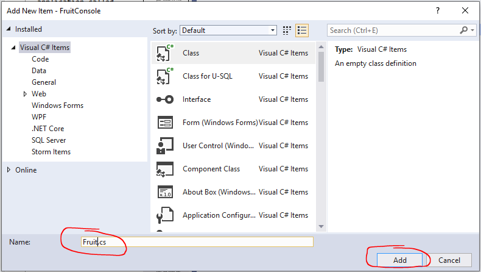
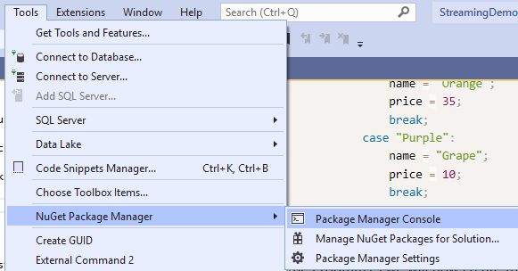
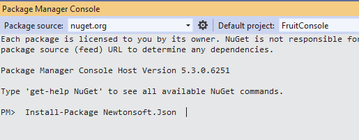
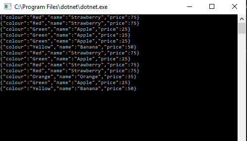

## Create Fruit Console App

1. In Visual Studio, create a new C# console application called "FruitConsole".

2.Add a class to your project.





3. Call it **Fruit.cs.**



4. Repeat the previous 2 steps for a Colour class called **Colour.cs.**

3. The Colour.cs will contain a list of enums for the colour of the fruit. Copy and paste the following code into your Colour.cs file undernath the class Colour. 

```c#
        public enum Name
        {
            Yellow = 0,
            Red = 1,
            Green = 2,
            Orange = 3,
            Purple = 4
        }
```

4. The Fruit.cs will contain the properties of the fruit, a method which generates the properties of the fruit based on the colour provided and  a constructor which creates the fruit using this method. Copy and paste the following code into your Fruit.cs file underneath the class Fruit. 

```c#
        public string colour { get; set; }

        public string name { get; private set; }

        public int price { get; private set; }

        public Fruit(string colour)

        {
            this.colour = colour;
            GetFruitNameAndPrice();
        }

        public void GetFruitNameAndPrice ()
        {
          switch (colour)
            {
                case "Yellow":
                    name = "Banana";
                    price = 50;
                    break;
                case "Red":
                    name = "Strawberry";
                    price = 75;
                    break;
                case "Green":
                    name = "Apple";
                    price = 25;
                    break;
                case "Orange":
                    name = "Orange";
                    price = 35;
                    break;
                case "Purple":
                    name = "Grape";
                    price = 10;
                    break;
            }
        }
``` 

5. In the Program.cs we will now create the fruit and output its properties to a console line in JSON format. In order to do this we first need to install the Newtonsoft.JSON package using the package manager. 
   * Go to Tools > Nuget Package Manager > Package Manager Console. 
   
   * Copy and paste this into the console that appears below.
```ps   
 Install-Package Newtonsoft.Json  
```
 
   * Press return.
   * Wait for the console to return package installed succesfully. This installed package will allow us to serialize the fruit object as JSON. 

6. At the top of your Program.cs file, where you can see the using statements, add the following:

```c#
using Newtonsoft.Json;
```

6. The Program.cs file will contain 2 methods, one to get a random waiting period and one to get a random colour name from our enums. The main method of the application will then perform a loop sending random colours, to receive random fruit messages in JSON format to the console, with a random wait period between each message. Copy and paste the following code into your Program.cs file underneath the class Program. 

```c#
        static void Main(string[] args)
        {
            while (1 == 1)
                {
                string a = GetRandomColour();
                Fruit fruit = new Fruit(a);
                var message = JsonConvert.SerializeObject(fruit);                 
                WaitRandom();
                Console.WriteLine(message);
            }
        }

        public static string GetRandomColour()
        {
            Array values = Enum.GetValues(typeof(Colour.Name));
            Random random = new Random();
            Colour.Name randomColour = (Colour.Name)values.GetValue(random.Next(values.Length));
            return randomColour.ToString() ;
        }

        public static void WaitRandom()
        {
            Random random = new Random();
            int randomWait = random.Next(0, 1000);
            System.Threading.Thread.Sleep(randomWait);
        }
```

7. Run your console application and you should see Fruit messages continually being returned with colour, name and price as below. You have now completed this section. 



[Back to ReadMe](../../../ReadMe.md)