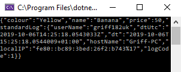
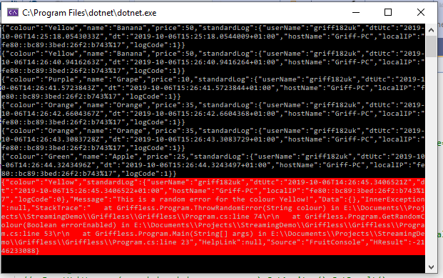

## Create Fruit Console App


1. In your FruitConsole project add two more class files, Exceptions.cs and StandardLog.cs.

3. The StandrdLog.cs will contain properties that you want to ensure you always log across all messages from your console app, actual fruit event messages and error messages. Your StandardLog class should look like this to capture the properties you want.

```c#
 public class StandardLog
    {
        public enum LogCode
        {
            Failure = 0,
            Success = 1
        }

        public string userName { get; private set; }

        public DateTime dtUtc { get; private set; }

        public DateTime dt { get; private set; }

        public string hostName { get; private set; }

        public string localIP { get; private set; }

        public LogCode logCode { get; private set; }

        public StandardLog(LogCode logCode)
        {
          this.userName = Environment.UserName;
          this.dtUtc = DateTime.UtcNow;
          this.dt = DateTime.Now;
          this.hostName = Dns.GetHostName();
          this.localIP = Dns.GetHostEntry(hostName).AddressList.GetValue(0).ToString();
          this.logCode = logCode;
        }
    }
```

4. The Exceptions.cs will contain a bespoke exception class type related to a colour. This will be called ColourException and behave accordingly when a ColourException is thrown. Your Exceptions.cs file should therefore look like the below, containing one class for ColourException.

```c#
    class ColourException : Exception
    {
        public string colour;

        public StandardLog standardLog { get; private set; }

        public ColourException(string message, string colour) : base(message)
        {
            this.colour = colour;
            standardLog = new StandardLog(StandardLog.LogCode.Failure);
        }
    }
``` 

5. We also now want to add the StandardLog properties to our Fruit.cs. In the Fruit class we will have a StandardLog object and in the constructor we will initiate a StandardLog so that these properties are all captured. Your Fruit class file should now contain the extract StandardLog object and the amendment to the constructor as shown below. 

```
        
public StandardLog standardLog { get; private set; }

        public Fruit(string colour)

        {
            this.colour = colour;
            GetFruitNameAndPrice();
            standardLog = new StandardLog(StandardLog.LogCode.Success);
        }
```

6. In the Program.cs file we now want to create a new method to generate random errors to simulate more real life data. Under the WaitRandom method add the following to create this.

```
        public static void ThrowRandomError(string colour)
        {
            Random random = new Random();
            int randomNum = random.Next(0, 10);
            if(randomNum == 1)
            {
                string message = "This is a random error for the colour " + colour + "!";
                throw new ColourException(message, colour);
            }
        }
```

7. We now want to use this random error in our GetRandomColour method. Amend the method to look like the below.

```
        public static string GetRandomColour(bool errorEnabled)
        {
            string randomColour;
            Array values = Enum.GetValues(typeof(Colour.Name));
            Random random = new Random();
            Colour.Name colour = (Colour.Name)values.GetValue(random.Next(values.Length));
            randomColour = colour.ToString();
            if (errorEnabled)
                {
                    ThrowRandomError(randomColour);
                }
            return randomColour;
        }
```

8. Finally we also want to wrap the Main method in a try / catch block so we can catch exceptions gracefully. Notice that we have also set the "true" parameter of the GetRandomColour method, signifying we want random errors to be generated. 

```
        static void Main(string[] args)
        {
            while (1 == 1)
                {
                try
                {
                    string a = GetRandomColour(true);
                    Fruit fruit = new Fruit(a);
                    var message = JsonConvert.SerializeObject(fruit);                 //Remember Install-Package Newtonsoft.Json
                    WaitRandom();
                    Console.WriteLine(message);
                }
                catch (ColourException e)
                {
                    Console.BackgroundColor = ConsoleColor.Red;
                    var error = JsonConvert.SerializeObject(e);
                    Console.WriteLine(error);
                    Console.ResetColor();
                }
            }
        }
```

8. Run your console application and you should see two new things:
   * The StandardLog properties being returned as part of your message.
   
   

   * Errors being randomly thrown in red which also contain the StandardLog properties.  

   

[Back to ReadMe](../../../ReadMe.md)


