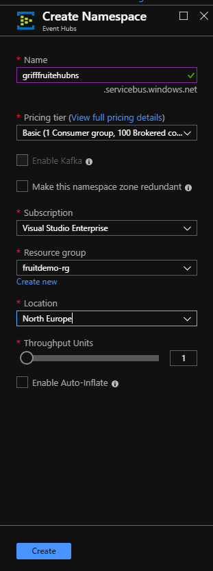
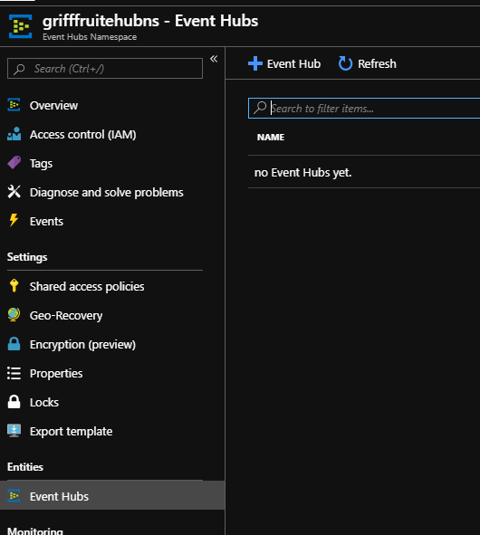
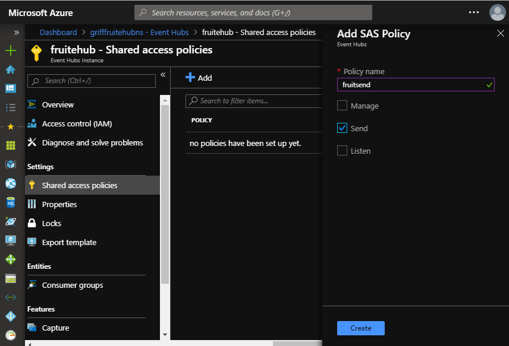

## Create Event Hub

You might want to create the event hub using the portal the first time you do it just to a graphical understanding of how the resources are put together. After this initial deployment it is recommended you use an ARM template so you can repeat it more easily and consistently. 

* [Create in Azure Portal](#Create-in-Azure-Portal)
* [Create with ARM Template](###Create-with-ARM-Template)

### Create in Azure Portal

1. Navigate to the [Azure Portal](https://portal.azure.com). 

2. Create a new eventhub namespace called {yourname}fruitehubns. Event hub namespaces are unique across Azure hence the need to prefix with your name.
  i. Click the green plus and search for event hub. 


   ii. Name it fruitehubns, use your appropriate subscription, use the resource group fruitdemo-rg, create it in the North Europe region and basic pricing tier. **It is important to create in the same region as where the data is going to be held where possible to reduce egress charges.**



3. Navigate to your newly created eventhub namespace, click event hubs and add an event hub.



4. Name it fruitehub and leave the defaults. 


5. Go into your newly created eventhub and click shared access policies. Create a new one called fruitsend with Send permissions.



6. Create another one called fruitlisten with Listen permissions.


[Back to ReadMe](../../../ReadMe.md)


### Create with ARM Template

1. In your FruitARM project, right-click the project and add a new item. Choose an Azure Resource Manager Deployment Template file. Rename it to be eventhub.json.

2.  In your FruitARM project, right-click the project and add a new item. Choose an Azure Resource Manager Parameters file. Rename it to be eventhub.parameters.json.

3. In the eventhub.parameters.json file, copy paste the following code.

```json
{
  "$schema": "https://schema.management.azure.com/schemas/2015-01-01/deploymentParameters.json#",
  "contentVersion": "1.0.0.0",
  "parameters": {
    "eventhubnamespace": {
      "value": "grifffruitehubns"
    },
    "eventhub": {
      "value": "fruitehub"
    },
    "eventhubsharedaccesspolicysend": {
      "value": "fruitsend"
    },
    "eventhublocation": {
      "value": "North Europe"
    }
  }
}
```

4. In the eventhub.json file, copy and paste the following code.

```json
{
  "$schema": "https://schema.management.azure.com/schemas/2015-01-01/deploymentTemplate.json#",
  "contentVersion": "1.0.0.0",
  "parameters": {

    "eventhubnamespace": {
      "defaultValue": "grifffruitehubns",
      "type": "string"
    },
    "eventhub": {
      "defaultValue": "fruitehub",
      "type": "string"
    },
    "eventhubsharedaccesspolicysend": {
      "defaultValue": "fruitsend",
      "type": "string"
    },
    "eventhublocation": {
      "type": "string",
      "allowedValues": [
        "North Europe",
        "West Europe"
      ],
      "defaultValue": "North Europe",
      "metadata": {
        "description": "The location in which the resources will be created."
      }
    }
  },
  "variables": {},
  "resources": [
    {
      "type": "Microsoft.EventHub/namespaces",
      "sku": {
        "name": "Basic",
        "tier": "Basic",
        "capacity": 1
      },
      "name": "[parameters('eventhubnamespace')]",
      "apiVersion": "2017-04-01",
      "location": "[parameters('eventhublocation')]",
      "resources": [
        {
          "type": "Microsoft.EventHub/namespaces/eventhubs",
          "name": "[concat(parameters('eventhubnamespace'), '/', parameters('eventhub'))]",
          "apiVersion": "2017-04-01",
          "location": "[parameters('eventhublocation')]",
          "properties": {
            "messageRetentionInDays": 1,
            "partitionCount": 2,
            "status": "Active"
          },
          "dependsOn": [
            "[resourceId('Microsoft.EventHub/namespaces', parameters('eventhubnamespace'))]"
          ],
          "resources": [
            {
              "type": "Microsoft.EventHub/namespaces/eventhubs/authorizationRules",
              "name": "[concat(parameters('eventhubnamespace'), '/', parameters('eventhub'), '/', parameters('eventhubsharedaccesspolicysend'))]",
              "apiVersion": "2017-04-01",
              "location": "[parameters('eventhublocation')]",
              "properties": {
                "rights": [
                  "Send"
                ]
              },
              "dependsOn": [
                "[resourceId('Microsoft.EventHub/namespaces', parameters('eventhubnamespace'))]",
                "[resourceId('Microsoft.EventHub/namespaces/eventhubs', parameters('eventhubnamespace'), parameters('eventhub'))]"
              ]
            },
{
              "type": "Microsoft.EventHub/namespaces/eventhubs/authorizationRules",
              "name": "[concat(parameters('eventhubnamespace'), '/', parameters('eventhub'), '/', parameters('eventhubsharedaccesspolicylisten'))]",
              "apiVersion": "2017-04-01",
              "location": "[parameters('eventhublocation')]",
              "properties": {
                "rights": [
                  "Listen"
                ]
              },
              "dependsOn": [
                "[resourceId('Microsoft.EventHub/namespaces', parameters('eventhubnamespace'))]",
                "[resourceId('Microsoft.EventHub/namespaces/eventhubs', parameters('eventhubnamespace'), parameters('eventhub'))]"
              ]
            }
          ]
        }
      ]
    }
  ]
}
```

5. Right-click the FruitARM project and select Deploy > New. 
  Choose the fruitdemo-rg resource group and ensure your correct template and parameters file are chosen for the eventhub resource. 


6. Confirm after deployment, which you can monitor via the output window, that the eventhub resources are in your resource group. 
* Eventhub namspace
* Eventhub
* Eventhub shared access policy

[Back to ReadMe](../../../ReadMe.md)
