# Create Stream to Power BI

1. If not stopped already, stop your stream analytics job.

1. Go your stream analytics job and a new Power BI Output called "FruitReport".

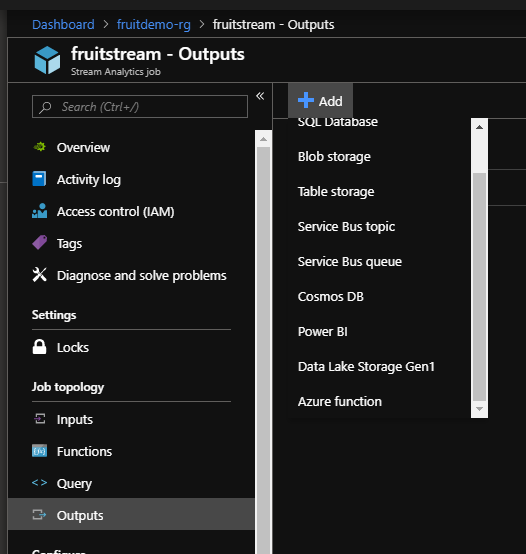

3. Enter the details as below and authorize to your Power BI account.

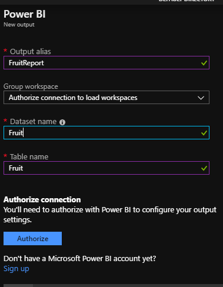

4. Amend your stream analytics query to include the following code:

```sql
SELECT
    [name] AS FruitName
    ,COUNT(*) AS FruitCount
INTO
    [fruitreport]
FROM
    [fruitstream]
WHERE [standardLog].[LogCode] = 1 --successful fruit send
GROUP BY 
    [name],
    SlidingWindow(second,10)
```
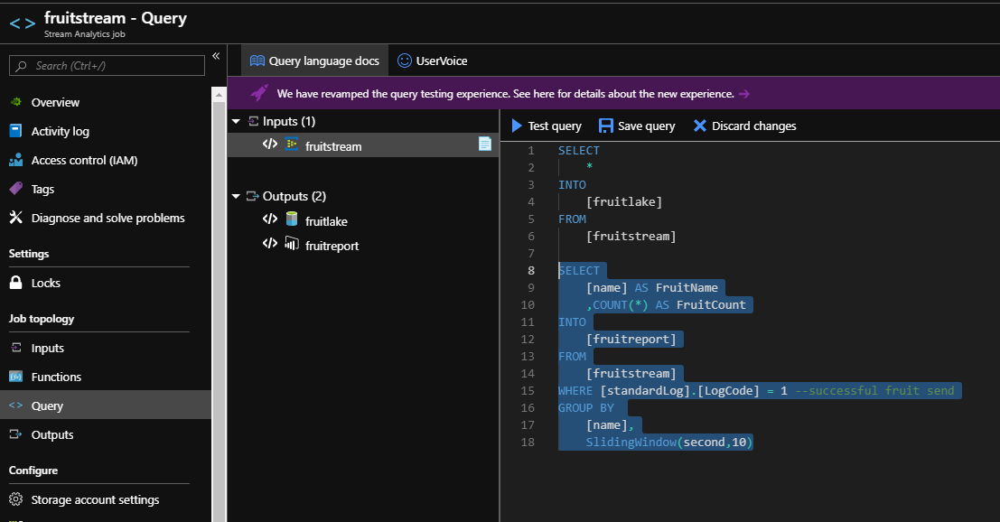

5. If you don't have it running, start your FruitConsole app.

6. Start your stream analytics job.

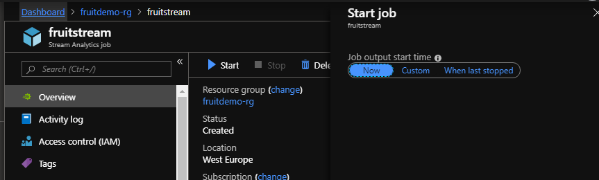

7. Go to your [Power BI Account](https://app.powerbi.com/home).

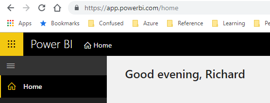

8. Go to your workspace. 

9. Go to datasets and (eventually) you will see a "Fruit" dataset.

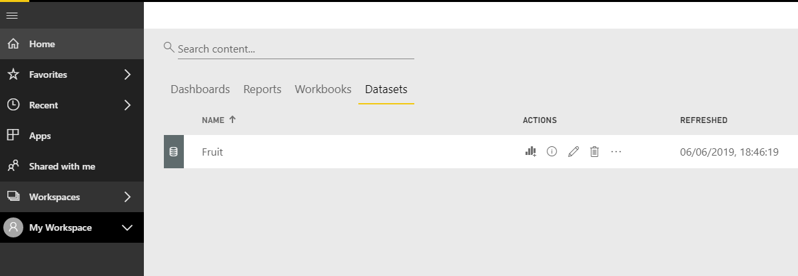

10. Create a new dashboard.

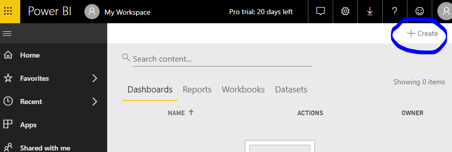

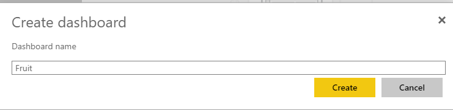

11. Add a real time tile to your dashboard.

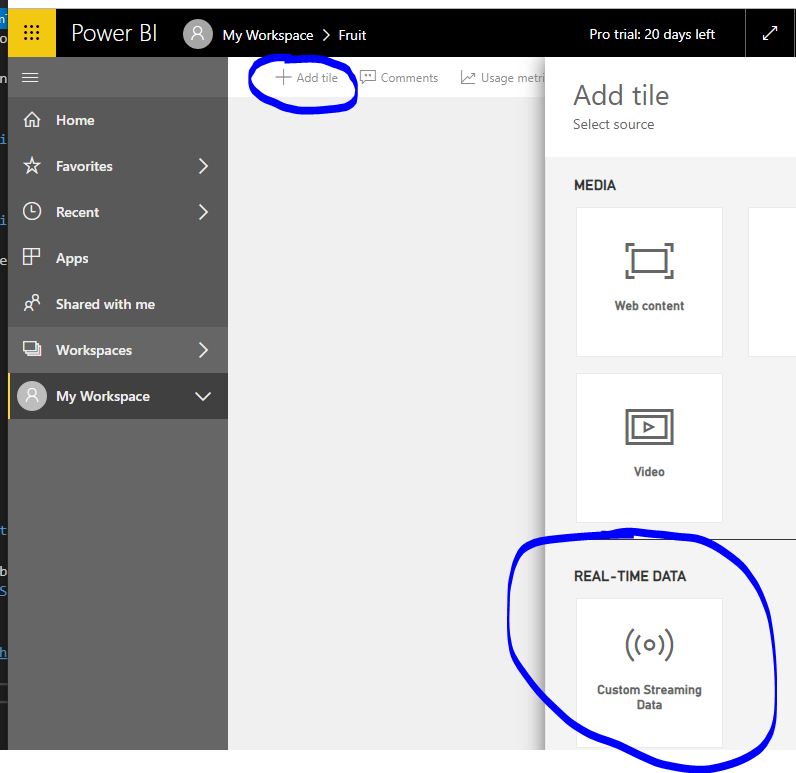

12. Select your fruit dataset. 

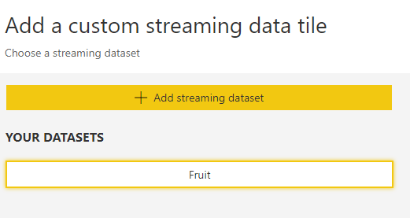


13. Enter the details of the fields to use in your tile as below. Use a card visualisation and use FruitCount as your field. 

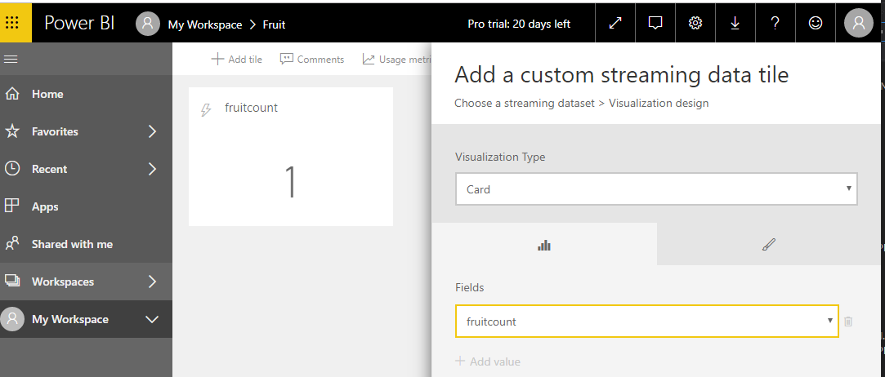

14. Set your title to be "Total Fruit Count Last 10 Seconds" and click apply.

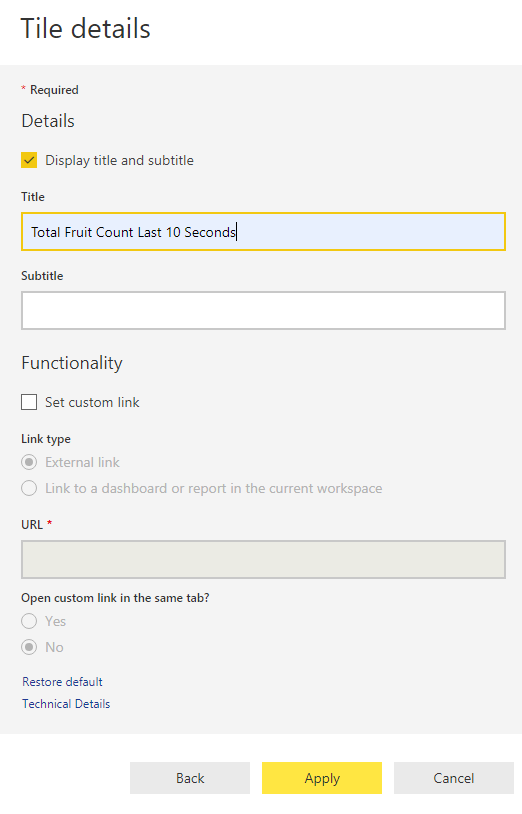

15. Expand your tile so that the title fits.

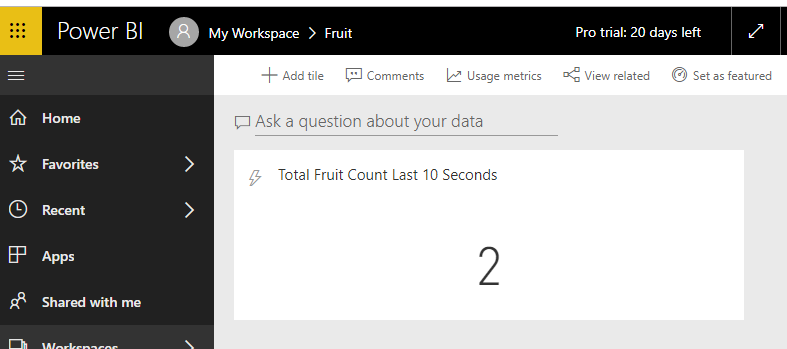

16. Add another tile using your fruit streaming dataset.

17. Choose clustered bar chart as your visualsation, use fruitname as your axis and fruitcount as your value.

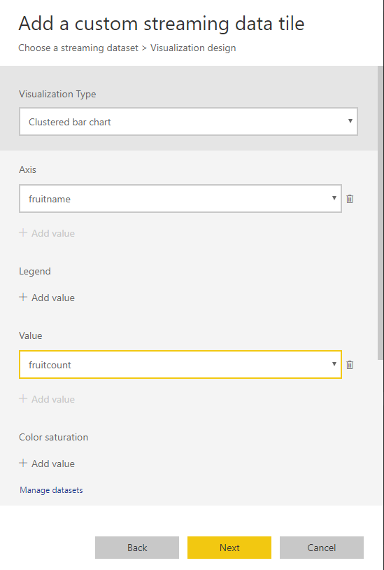

18. Set your title to be "Fruit Count Last 10 Seconds" and click apply.

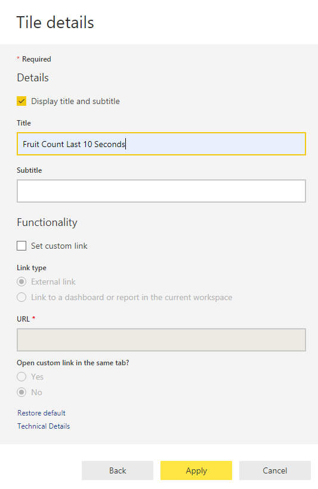

19. You should end up with a moving real time dashboard as below.

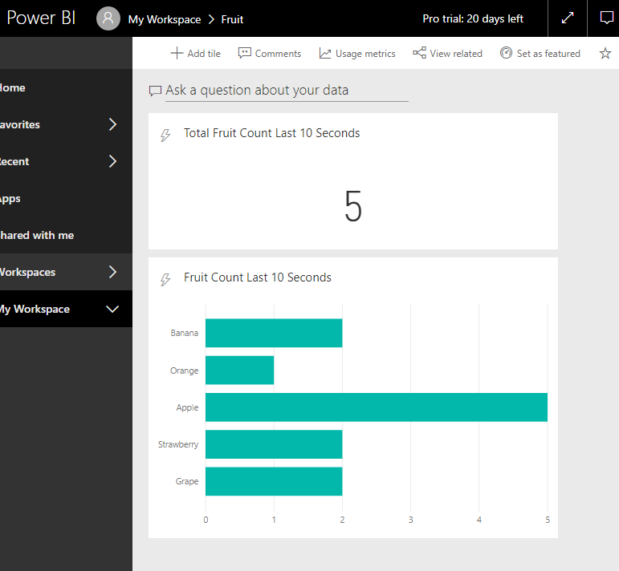

[Back to ReadMe](../../../ReadMe.md)
