## Create Azure SQL DB

You might want to create the Azure SQL database using the portal the first time you do it just to a graphical understanding of how the resources are put together. After this initial deployment it is recommended you use an ARM template so you can repeat it more easily and consistently. 

* [Create in Azure Portal](#Create-in-Azure-Portal)
* [Create Azure SQL with ARM Template](###Create-with-ARM-Template)
* [Create SQL Schema with DB Project](###Create-Schema-with-DB-Project)

### Create in Azure Portal

1. Navigate to the [Azure Portal](https://portal.azure.com) and go to your fruitdemo-rg resource group. 

2. Create a new resource in your fruitdemo-rg resource group.

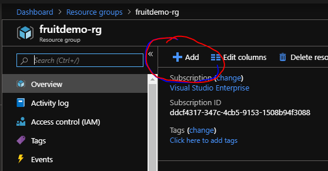

3. Create an Azure SQL resource.

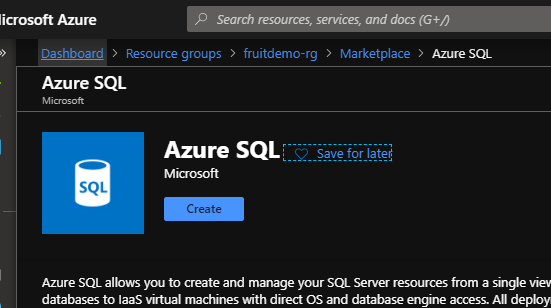

4. Choose to create a single database.

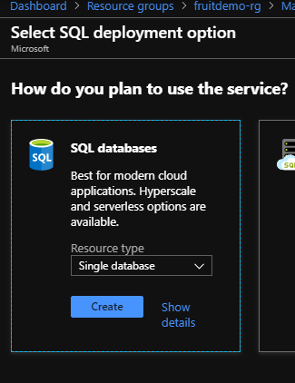

5. Set the basic settings:
* Ensure your required subscription is selected.
* Choose your fruitdemo-rg resource group.
* Set the database name to be Fruit. 
* Create new server...
  * Give it a unique name e.g. {yourname}-fruit-sql
  * Create an admin user e.g. {yourname}admin
  * Set a password. **Remember this password as we will be using it later to stream the data in the next step.**
  * Ensure the location is the same as your other resources, North Europe. 
  * Click OK on your server settings. 

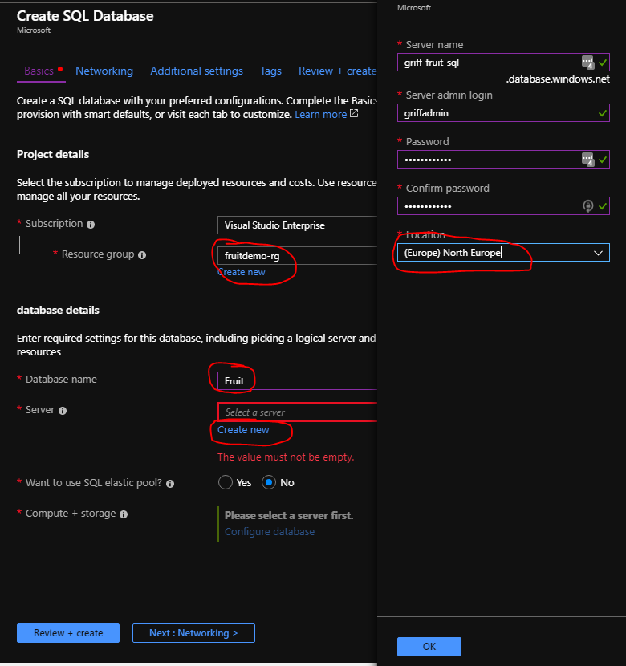

6. Click configure database settings. 

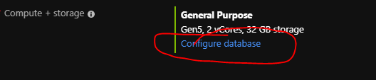

7. Choose "looking for basic, standard, premium" at the top. We are going to use Basic DTU pricing for this demo just to keep it simple.  
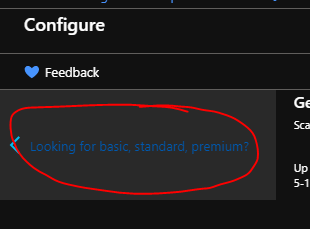

8. Choose basic tier.  

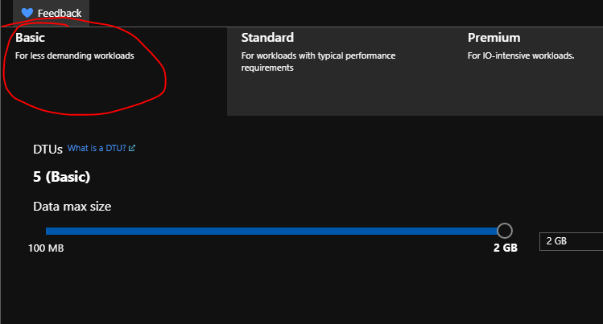

9. Apply basic tier.  

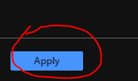

10. Click review and create.

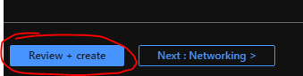

11. Check your final settings and then click Create.

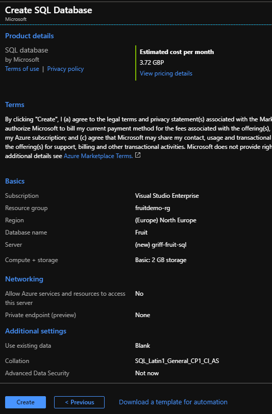

12. It will take a few minutes to deploy, then navigate to your fruitdemo-rg and you will now see your azure sql resource. 

13. Go to your server, select Firewalls and Virtual Networks, then click Add Client IP.

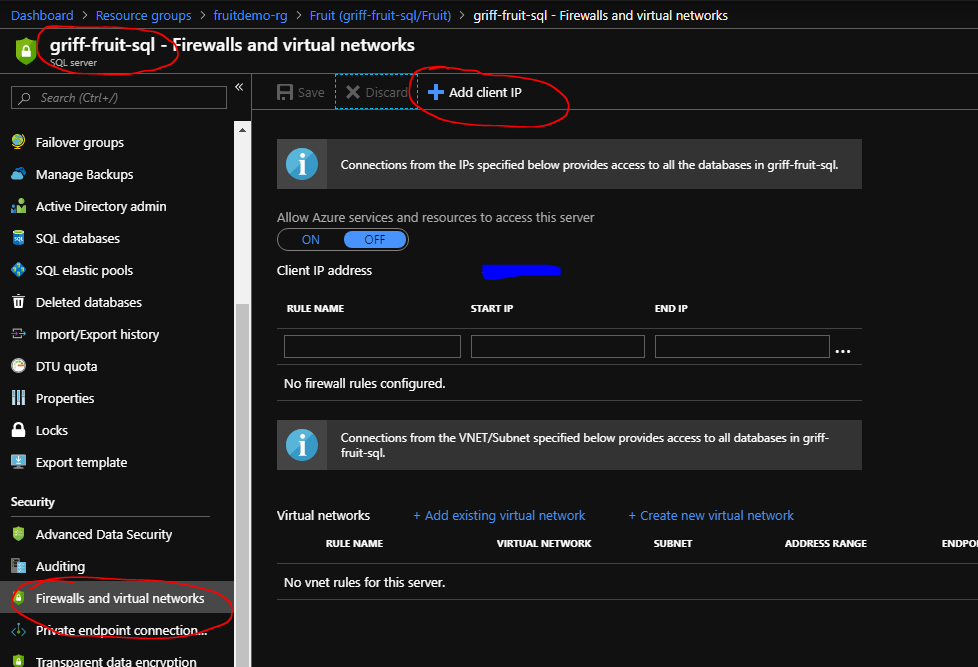

14. Save the client IP you have added. This allows you to connect to the server from your machine. 

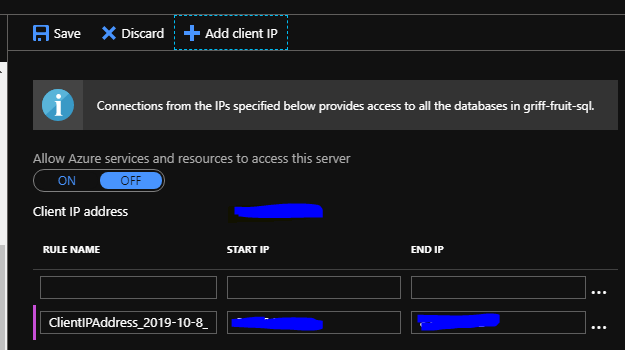

15. You also need to Allow Azure Services On in order for the streaming job to write to the database. **Disclaimer:** Opening this firewall rule means that the non-fixed IP address stream analytics can connect to the database, but it also means any other Azure resource could potentially connect to your database too. Please take other security measures if considering doing this in production.

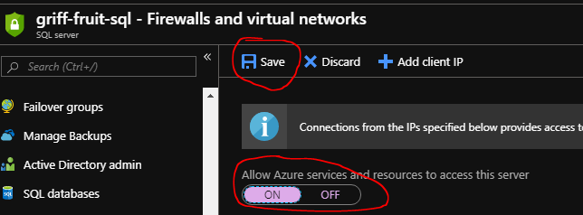

15. Now you need to create the database table you are going to stream into, you can do this in the portal. Navigate to the fruit database, click query editor.

16. When prompted enter the password for the admin user your created. 

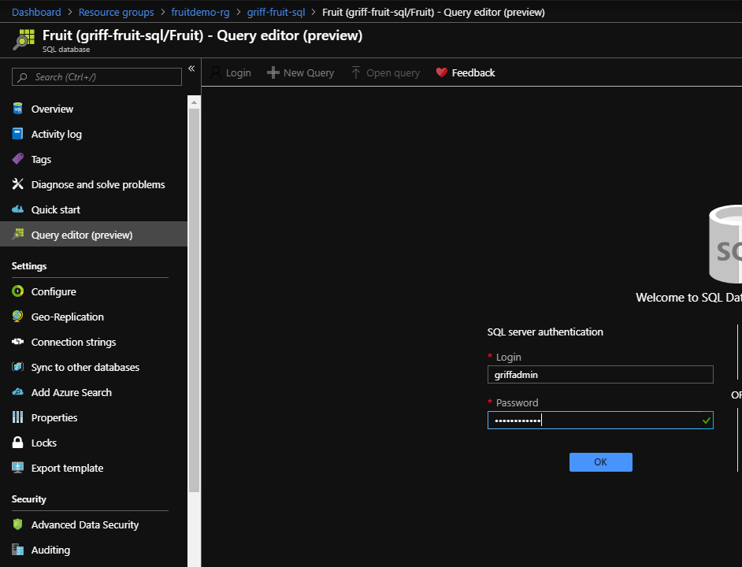

17. Paste in the below SQL then click Run. 

```sql
CREATE SCHEMA [Store];
GO 

CREATE TABLE [Store].[Fruit]
(
	[FruitId]  INT IDENTITY NOT NULL CONSTRAINT [PK_Fruit] PRIMARY KEY CLUSTERED,
	[FirstInserted] DATETIME2 NOT NULL CONSTRAINT [DF_Fruit_FirstInserted] DEFAULT SYSUTCDATETIME(),
	[Name] VARCHAR(20) NOT NULL,
	[Colour] VARCHAR(20) NOT NULL,
	[Price] SMALLINT NOT NULL, 
        [FruitUser] VARCHAR(128) NOT NULL, 
        [FruitDate] DATETIME2 NOT NULL
);
GO 

```

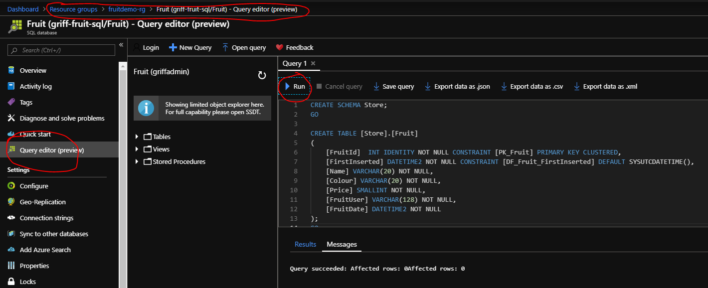

16. You now have the SQL infrastructure and schema to stream into. 

[Back to ReadMe](../../../ReadMe.md)

### Create with ARM Template

[Back to ReadMe](../../../ReadMe.md)

### Create Schema with DB Project

[Back to ReadMe](../../../ReadMe.md)

