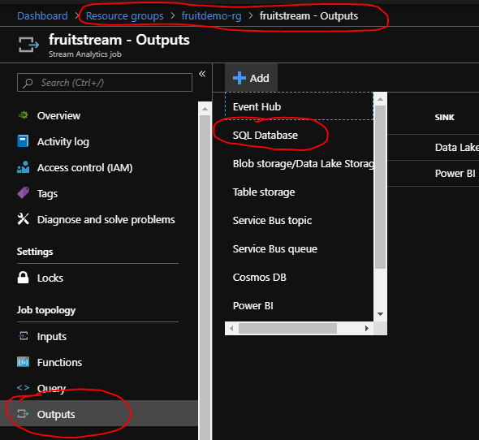
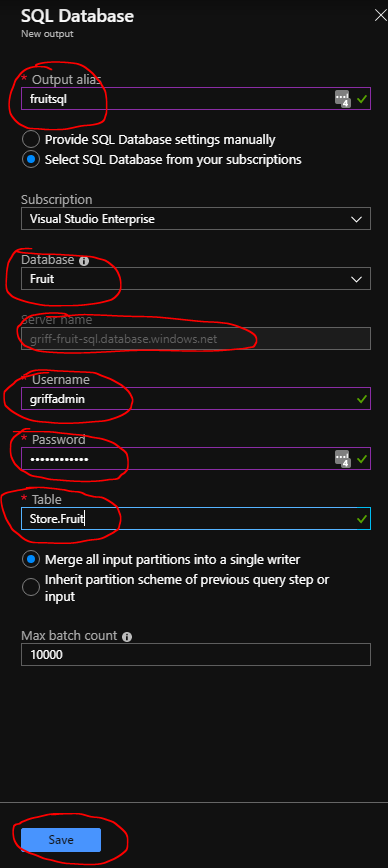
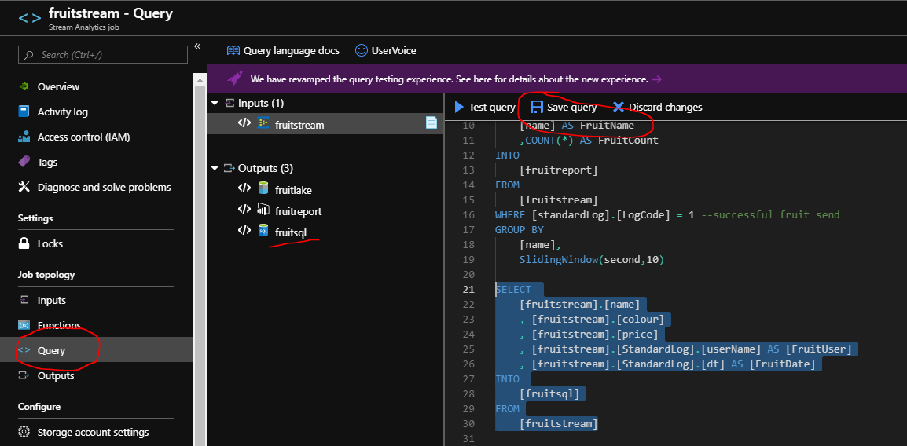
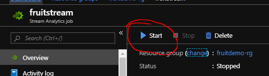
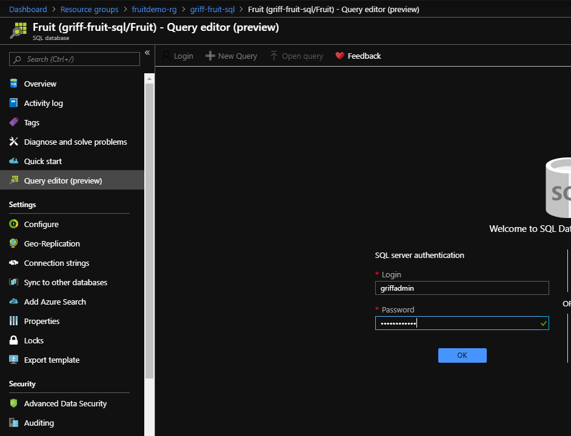
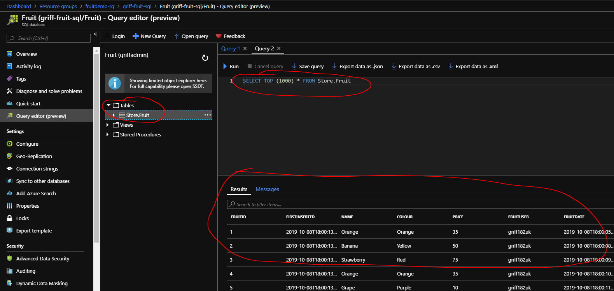

# Create Stream to Azure SQL

1. If not stopped already, stop your stream analytics job.

1. Go your stream analytics job and a new Azure SQL Output.



3. Configure your sql output.
* Set the output alias to be fruitsql.
* Set the database to be fruit from the correct subscription and server.
* Enter your server admin user and password. **Disclaimer** In production a more secure account should be used!
* Set the table to be Store.Fruit. 
* Click Save. 



4. Amend your stream analytics query to contain the following after your other queries, which streams the data to the Azure SQL DB you just configured as an output. 

```sql

SELECT 
    [fruitstream].[name]
    , [fruitstream].[colour]
    , [fruitstream].[price]
    , [fruitstream].[StandardLog].[userName] AS [FruitUser]
    , [fruitstream].[StandardLog].[dt] AS [FruitDate]
INTO 
    [fruitsql]
FROM
    [fruitstream]
```



5. Start your job and ensure your console app is running. 



6. Go to your SQL database and login to the query editor. 



7. Select * from your Store.FruitTable and you should see your streamed in fruit messages. So we now have the lake, power bi and the SQL DB all being streamed in to at the same time. Huzzah! 



[Back to ReadMe](../../../ReadMe.md)
